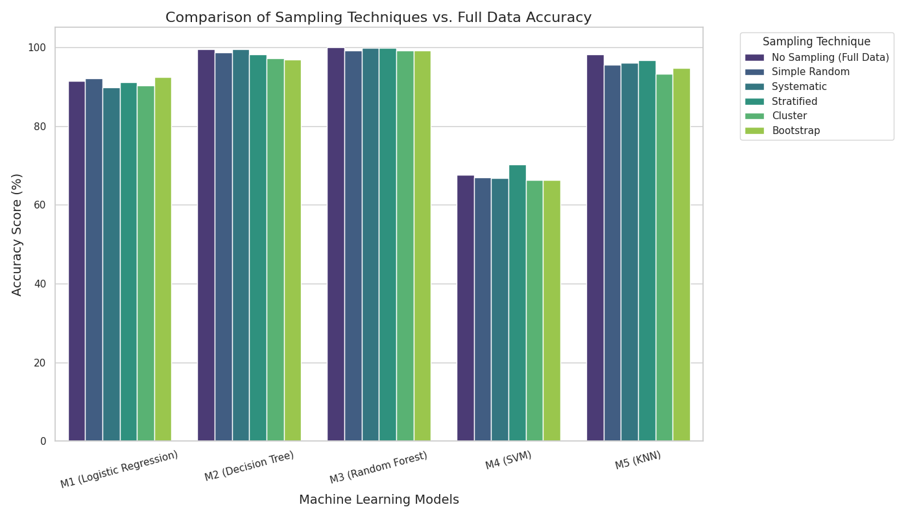

# Sampling Assignment: Credit Card Fraud Detection

## 1. Project Overview
This project investigates the impact of different sampling techniques on the performance of machine learning models. Using a dataset of Credit Card Fraud transactions, we analyze whether we can maintain high model accuracy using smaller, representative samples compared to using the entire dataset.

## 2. Methodology

### Data Preprocessing
* **Dataset:** Credit Card Fraud Detection dataset.
* **Balancing:** The original dataset was highly imbalanced. We balanced it using **Oversampling** (duplicating the minority class) to create a balanced dataset of 1526 rows (50% Fraud, 50% Non-Fraud).

### Sampling Techniques
We calculated a required sample size of **385** using Cochran's Formula (95% confidence, 5% margin of error) and applied five sampling techniques:
1.  **Simple Random Sampling:** Randomly selects samples from the population.
2.  **Systematic Sampling:** Selects every $k^{th}$ member of the population.
3.  **Stratified Sampling:** Divides the population into subgroups (strata) and samples from each to preserve the class distribution (Fraud vs. Non-Fraud).
4.  **Cluster Sampling:** Divides the population into clusters and randomly selects entire clusters.
5.  **Bootstrap Sampling:** Samples with replacement, allowing the same data point to be selected multiple times.

### Models Evaluated
We tested the samples on five different machine learning models:
* **M1:** Logistic Regression
* **M2:** Decision Tree
* **M3:** Random Forest
* **M4:** Support Vector Machine (SVM)
* **M5:** K-Nearest Neighbors (KNN)

## 3. Results
The table below compares the accuracy of models trained on the **Full Dataset** (Baseline) versus models trained on the specific **Samples**.

| Model | No Sampling (Full Data) | Simple Random | Systematic | Stratified | Cluster | Bootstrap |
| :--- | :---: | :---: | :---: | :---: | :---: | :---: |
| **M1 (Logistic Regression)** | 91.36% | 92.15% | 89.79% | 91.10% | 90.31% | **92.41%** |
| **M2 (Decision Tree)** | 99.48% | 98.69% | **99.48%** | 98.17% | 97.12% | 96.86% |
| **M3 (Random Forest)** | 100.00% | 99.21% | **99.74%** | **99.74%** | 99.21% | 99.21% |
| **M4 (SVM)** | 67.54% | 67.02% | 66.75% | **70.16%** | 66.23% | 66.23% |
| **M5 (KNN)** | 98.17% | 95.55% | 96.07% | **96.60%** | 93.19% | 94.76% |

## 4. Discussion & Analysis
* **Best Sampling Technique:** **Stratified Sampling** proved to be the most robust technique overall. It yielded the highest accuracy for SVM (surpassing the full dataset) and tied for the best performance on Random Forest. This success is likely because it strictly enforces the 50/50 class ratio in the sample, ensuring the model sees a representative mix of fraud and non-fraud cases.
* **Model Robustness:** **Random Forest** and **Decision Tree** models were incredibly robust, achieving near-perfect accuracy (99%+) regardless of the sampling technique used. This indicates these models are well-suited for this type of tabular classification data.
* **Surprising Findings:** For **Logistic Regression**, the **Bootstrap Sample** (92.41%) outperformed the full dataset (91.36%). Similarly, for **SVM**, the **Stratified Sample** (70.16%) significantly beat the full dataset (67.54%). This suggests that in some cases, a smaller, cleaner sample can reduce noise and improve generalization compared to the full training set.

## 5. Performance Graph
The following graph visualizes the accuracy comparison across all models and sampling techniques.



## 6. How to Run
1.  Ensure `Creditcard_data.csv` is in the repository folder.
2.  Install dependencies:
    ```bash
    pip install pandas numpy scikit-learn matplotlib seaborn
    ```
3.  Run the notebook or python script to generate the results and graph.